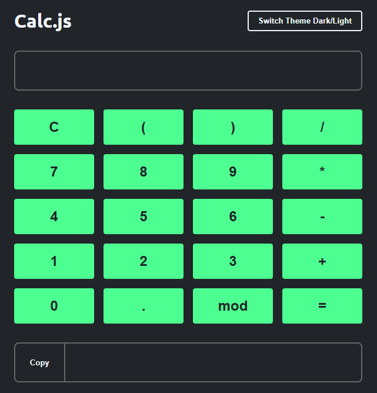

# 🧮 Calculadora Web

Este projeto é uma calculadora simples desenvolvida com **HTML, CSS e JavaScript**, que permite realizar operações matemáticas básicas. O design inclui alternância entre tema claro e escuro, além de recursos como copiar o resultado para a área de transferência.

## 🚀 Funcionalidades

- Teclado virtual com botões interativos
- Suporte ao teclado físico (enter, números, operadores, backspace)
- Cálculo de expressões matemáticas básicas
- Botão de limpar entrada
- Copiar resultado para a área de transferência
- Alternância entre tema claro e escuro

## 💻 Tecnologias

- HTML
- CSS
- JavaScript

## 📸 Demonstração

## ⚠️ Aviso de Segurança
Atenção: Este projeto utiliza eval() para processar expressões matemáticas. Essa função pode ser perigosa se usada com entradas não validadas, portanto não é recomendada em ambientes de produção. Aqui, foi utilizada apenas com fins educacionais.
